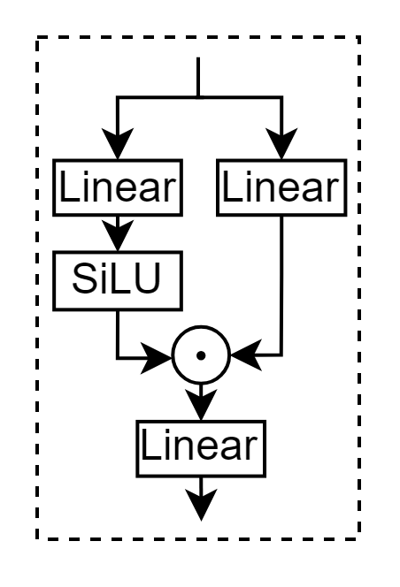

假设输入 x 的形状为 (1, 128, 2048)，代表(batch_size, seq_len, hidden_dim)。
使用如下 pytorch 代码模拟 cuda 算子流程。
# fused_softmax_topk
```python
@torch.no_grad()
def fused_softmax_topk(gating_output, k):
    seq_len = gating_output.shape[0]  # seq_len = 128
    routing_weights = F.softmax(gating_output, dim=1, dtype=torch.float)  # 计算每个token对应expert的得分，作为权值
    topk_weights, topk_indices = torch.topk(routing_weights, k, dim=-1)   # [128, 4], 选出每个token对应的top4的expert，返回对应的得分权值，以及专家索引
    token_expert_indices = (torch.arange(k)*seq_len).view(1,k).repeat(seq_len,1)+(torch.arange(seq_len).view(-1,1).repeat(1,4))

    topk_weights = topk_weights.to(gating_output.dtype)
    return topk_weights,topk_indices,token_expert_indices
```

输出：
- topk_weights：形状是(128, 4)，含义是每个token对应的top4的专家的score(val: 0~1)，作为加权求和的权值
- topk_indices：形状是(128, 4)，含义是每个token对应的top4的专家的索引(val: 0~59)
- token_expert_indices：形状是(128, 4)，是一张索引表，下一个算子会用到，其含义是：
    - 0~127 表示 token1~128 的 top1
    - 128~255 表示 token1~128 的 top2
    - 256~383 表示 token1~128 的 top3
    - 384~511 表示 token1~128 的 top4
```
tensor([[  0, 128, 256, 384],
        [  1, 129, 257, 385],
        [  2, 130, 258, 386],
				...
        [126, 254, 382, 510],
        [127, 255, 383, 511]])
```

# expert_resetv2
```python
@torch.no_grad()
def expert_resetv2(topk_indices, token_expert_indices):
    topk_indices_flat = topk_indices.view(-1)  # 展平 [128,4] => [512]
    token_expert_indices_flat = token_expert_indices.view(-1) # 展平 [128,4] => [512]

    vas = torch.linspace(0, 0.99, topk_indices_flat.shape[0])  # 产生512个从0到0.99等距分布的数字

    # Sort the indices based on topk_indices
    sorted_indices = torch.argsort(topk_indices_flat+vas)  # +vas是为了保持相对顺序不变

    sorted_topk_indices = topk_indices_flat[sorted_indices]
    sorted_token_expert_indices = token_expert_indices_flat[sorted_indices]
    return sorted_topk_indices, sorted_token_expert_indices
```

输入是 topk_indices 和 token_expert_indices，二者都是按照 token1, token2, ..., token128 排序的。

expert_resetv2 是将 topk_indices 和 token_expert_indices 按照 expert1, expert2, ..., expert128 排序的，通过输出的 sort_token_expert_indices，可以知道 sorted_topk_indices 中每个专家索引分别对应哪个 token 的 top 几。

sorted_topk_indices：
```
tensor([ 0,  0,  0,  0,  0,  0,  0,  0,  0,  0,  0,  1,  1,  1,  1,  1,  1,  1,
         1,  1,  2,  2,  2,  2,  2,  2,  3,  3,  3,  3,  3,  3,  3,  3,  3,  3,
         3,  4,  4,  4,  4,  4,  4,  4,  4,  4,  4,  5,  5,  5,  5,  5,  5,  5,
         5,  5,  5,  5,  5,  5,  5,  5,  6,  6,  6,  6,  6,  6,  6,  6,  6,  7,
         7,  7,  7,  7,  7,  7,  7,  8,  8,  8,  8,  8,  8,  8,  8,  8,  8,  9,
         9,  9,  9,  9,  9, 10, 10, 10, 10, 10, 11, 11, 11, 11, 11, 11, 11, 11,
        12, 12, 12, 12, 13, 13, 13, 13, 14, 14, 14, 14, 14, 14, 14, 14, 14, 14,
        15, 15, 15, 15, 15, 15, 15, 15, 15, 16, 16, 16, 16, 16, 16, 16, 16, 16,
        16, 16, 16, 17, 17, 17, 17, 17, 17, 17, 17, 17, 17, 17, 18, 18, 18, 18,
        18, 18, 18, 18, 18, 19, 19, 19, 19, 19, 19, 19, 19, 19, 19, 19, 19, 19,
        19, 20, 20, 20, 20, 20, 20, 20, 20, 21, 21, 21, 21, 21, 21, 21, 21, 22,
        22, 22, 22, 22, 23, 23, 23, 23, 23, 23, 23, 24, 24, 24, 24, 24, 25, 25,
        25, 25, 25, 25, 25, 25, 25, 25, 25, 26, 26, 26, 26, 26, 26, 27, 27, 27,
        27, 27, 27, 27, 27, 27, 27, 28, 28, 28, 28, 28, 28, 29, 29, 29, 29, 29,
        29, 29, 29, 29, 29, 29, 29, 30, 30, 30, 30, 30, 31, 31, 31, 31, 31, 31,
        31, 31, 31, 32, 32, 32, 32, 32, 32, 32, 32, 32, 32, 32, 32, 33, 33, 33,
        33, 33, 33, 33, 33, 33, 34, 34, 34, 34, 34, 34, 35, 35, 35, 35, 35, 35,
        35, 36, 36, 36, 36, 36, 36, 36, 37, 37, 37, 37, 37, 37, 37, 37, 38, 38,
        38, 38, 38, 38, 39, 39, 39, 39, 39, 39, 40, 40, 40, 40, 40, 40, 40, 40,
        41, 41, 41, 41, 41, 41, 41, 41, 41, 41, 41, 42, 42, 42, 42, 42, 42, 42,
        43, 43, 43, 43, 43, 44, 44, 44, 44, 44, 44, 44, 44, 44, 45, 45, 45, 45,
        45, 45, 45, 45, 45, 45, 46, 46, 46, 46, 46, 46, 46, 46, 46, 46, 47, 47,
        47, 47, 47, 47, 47, 47, 47, 48, 48, 48, 48, 48, 48, 49, 49, 49, 49, 49,
        49, 49, 49, 50, 50, 50, 50, 50, 50, 50, 50, 50, 50, 50, 50, 51, 51, 51,
        51, 51, 51, 52, 52, 52, 52, 52, 52, 52, 52, 52, 53, 53, 53, 53, 53, 53,
        53, 53, 53, 53, 53, 53, 53, 53, 54, 54, 54, 54, 54, 54, 54, 54, 54, 55,
        55, 55, 55, 55, 55, 55, 55, 55, 55, 56, 56, 56, 56, 56, 56, 56, 56, 56,
        56, 56, 57, 57, 57, 57, 57, 57, 57, 57, 57, 57, 57, 57, 57, 57, 58, 58,
        58, 58, 58, 58, 59, 59, 59, 59])
```

sorted_token_expert_indices：
```
tensor([262,   7, 397, 304, 324, 339, 468,  93,  98, 356, 363, 257, 143, 166,
        309, 198,  80,  87, 475, 243,  44, 454, 333, 341, 489, 237, 256,   8,
        272, 401, 158, 426, 449, 460, 223, 234, 503, 147,  29,  45, 434,  55,
        444,  63, 370, 377, 378,   2, 139,  14, 399, 419, 295, 440,  60,  90,
        107, 369, 498, 247, 505, 125, 384, 385, 132, 390, 265,  49,  68,  76,
        483, 133, 270,  15, 294, 174,  65, 213, 367,  17, 290, 432, 205,  79,
        465, 473, 225,  99, 246, 261, 263,  71, 207, 224, 354, 141, 274, 215,
        112, 127, 392, 140, 405, 285, 172,  54, 453, 248,  30, 293, 238, 254,
         25, 296, 329, 236, 393, 186, 447, 327, 334, 337, 101, 232, 121, 507,
          1,  19, 418, 425,  57, 469, 342,  97, 366, 159, 289, 164,  41,  42,
        436,  58,  77, 220, 355, 497, 376, 391,  24, 282, 435, 204, 336, 229,
        486, 487, 233, 115, 134, 144, 280, 167,  72, 372, 374, 251, 255, 287,
        288, 417, 305, 313, 318, 451,  73, 338, 481, 110, 239, 113, 381, 259,
        408, 411, 156, 325, 328, 510, 383, 279,  32,  34, 423,  47,  64, 326,
        122, 153, 438, 183, 188, 189, 264, 424, 173, 323,  96, 501, 508, 403,
        165, 427, 201, 244, 152, 409, 283, 157,  35, 442,  74, 472,  91, 490,
        375,  18, 306, 310, 228, 496, 118, 258, 171, 301,  61, 450, 485, 364,
        250, 379, 509, 135, 151, 184, 330, 347, 360, 266, 271, 404,  37, 422,
        180, 437,  86, 226, 100, 230, 114,   3, 182, 212, 344, 123, 137,  10,
        148,  33, 194,  83, 477, 484, 380, 395, 414, 162, 176,  82,  84, 214,
        471, 351, 103, 488, 492, 128, 130, 136,  22, 181, 456, 210, 502, 126,
        406, 284, 202, 332, 493, 511, 269, 448, 193, 340,  92, 358, 253,  16,
        413, 445, 217, 352, 120, 249, 275,  26, 430, 321,  69,  81, 216, 227,
        281, 155, 421,  50, 311, 462, 386, 142, 331, 335, 495, 245, 131, 149,
        420, 297, 298,  48, 474, 482, 138, 299,  59, 320, 343, 476, 221, 222,
        357, 105, 362, 273, 150, 314, 190, 461, 206,  89, 175, 195, 466, 349,
        491,  21, 300,  53, 187, 345, 480, 365, 504, 382, 146,  31, 161, 178,
        317, 196, 211, 353, 235, 252, 387, 389, 154,  28, 160, 443, 191, 459,
        359, 109, 407,  38, 302, 431, 177, 479, 231, 242, 373, 307, 308,  56,
         66,  94, 371,   9, 268, 412, 303, 464, 218, 116, 119,   0, 277,  23,
         27, 428, 203, 208, 346, 106, 108, 111, 124, 398, 179, 452, 458, 470,
        478, 396, 286,  51, 312, 441, 457,  95, 102, 494,   5,   6, 267, 145,
        276, 278,  40, 170, 429, 197,  70, 219, 350, 240, 129,   4,  12, 402,
        410,  67,  88, 241, 500, 388,  43,  46,  62, 322, 455, 463,  85, 348,
        499,  20, 416, 291, 168,  52, 316, 319, 199, 200,  75, 506, 260,  13,
        400, 415, 163, 292, 433, 439, 446, 192,  78, 209, 104, 368,  11,  36,
         39, 185, 361, 117, 394, 169, 315, 467])
```

# expert_copy
```python
@torch.no_grad()
def expert_copy(inputs, sorted_token_expert_indices):
    seq_len, hidden_units = inputs.shape  # [128, 2048]
    copy_outputs = torch.zeros(seq_len*k, hidden_units).half()  # torch.Size([512, 2048]), 每个token要分配4个专家
    dst_2_src_line = torch.zeros(seq_len*k, dtype=torch.int32)  # torch.Size([512]), 记录每行对应
    for i in range(seq_len*k):
        dst_2_src_line[sorted_token_expert_indices[i]] = i      # 假设i=126, sorted_token_expert_indices[126] = 1, 那么dst_2_src_line[1] = 126, 说明，copy_outputs的第126行，对应第(1%128=1)个token，top (1/128+1 = 1)

# 所以, dst_2_src_line的作用就是，token号==>copy_outputs中的行
        copy_outputs[i] = inputs[sorted_token_expert_indices[i] % seq_len]  # 复制4倍后的数组，copy_outputs是按照专家顺序排序的，比如copy_outputs[0:11]对应专家0
    return copy_outputs, dst_2_src_line
```

# compute_total_rows_before_expert
```python
def compute_total_rows_before_expert(sorted_experts, num_experts):
    """
    计算每个专家在 sorted_experts 中出现的总行数。
    """
    total_rows_before_expert = [0] * num_experts
    for expert in range(num_experts):
        total_rows_before_expert[expert] = find_total_elts_leq_target(sorted_experts, expert)
    return np.array(total_rows_before_expert)
```

total_rows_before_expert：
```
array([ 11,  20,  26,  37,  47,  62,  71,  79,  89,  95, 100, 108, 112,
       116, 126, 135, 147, 158, 167, 181, 189, 197, 202, 209, 214, 225,
       231, 241, 247, 259, 264, 273, 285, 294, 300, 307, 314, 322, 328,
       334, 342, 353, 360, 365, 374, 384, 394, 403, 409, 417, 429, 435,
       444, 458, 467, 477, 488, 502, 508, 512])
```

total_rows_before_expert 是一个**前缀表**，我们分析前三个元素：
- **11**，专家1处理 **11** 个token
- **20**，$20 - 11=9$，专家2处理 **9** 个token
- **26**，$26 - 20=6$，专家3处理 **6** 个token

# do_expertv2
每个专家计算自己负责的token，需要经过下面这些层：

<div align=center>

</div>

```python
@torch.no_grad()
def do_expertv2(copy_outputs,moe_weight1,moe_weight2,total_rows_before_expert):
    # copy_outputs.shape = torch.Size([512, 2048]), moe_weight1.shape = torch.Size([60, 2048, 2816]), moe_weight2.shape = torch.Size([60, 1408, 2048])
    gemm_outputs1 = torch.zeros(copy_outputs.shape[0],moe_weight1.shape[-1]).half()  # torch.Size([512, 1408*2])
    gemm_outputs2 = torch.zeros(copy_outputs.shape[0],moe_weight2.shape[-1]).half()  # torch.Size([512, 2048])


    pre_value=0
    for i in range(len(total_rows_before_expert)):  # [0, 60)
        if(i!=0):
            pre_value = total_rows_before_expert[i-1]
        
        token_length = total_rows_before_expert[i] - pre_value  # 根据前缀表计算当前专家处理的token数量

        if(token_length==0):
            continue

        lef_mat   = copy_outputs[pre_value:pre_value+token_length]  # 取出当前专家负责的那些token, 作为左矩阵, [11, 2048]
        right_mat = moe_weight1[i]  # 当前专家对应的linear层，包含gate_proj和up_proj, shape是[2048, 1408*2]

        gemm_outputs1[pre_value:pre_value+token_length] = lef_mat @ right_mat  # 进行Linear层的映射

    silu_outputs = gated_silu(gemm_outputs1, dimension=moe_weight1.shape[-1]//2)

    pre_value=0

    for i in range(len(total_rows_before_expert)):
        if(i!=0):
            pre_value= total_rows_before_expert[i-1]
        
        token_length = total_rows_before_expert[i] - pre_value

        if(token_length==0):
            continue

        lef_mat   = silu_outputs[pre_value:pre_value+token_length]
        right_mat = moe_weight2[i]

        gemm_outputs2[pre_value:pre_value+token_length] = lef_mat @ right_mat

    return gemm_outputs2
```

# moe_routing
```python
@torch.no_grad()
def moe_routing(gemm_outputs, topk_weights, dst_2_src_line):
    seq_len, hidden_units = gemm_outputs.shape  # torch.Size([512, 2048])
    seq_len = seq_len // 4  # 512 => 128

    outputs = torch.zeros(seq_len, hidden_units).half()  # torch.Size([128, 2048])
    # gemm_outputs是按照专家排序的，所以需要dst_2_src_line来根据token号，找到
    for i in range(seq_len):  # 遍历每个token
        for j in range(4):    # 遍历该token的每个专家
            outputs[i] += gemm_outputs[dst_2_src_line[j*seq_len+i]] * topk_weights[i][j]  # 

    return outputs
```

## 测试输出
```shell
$ python qwen_moe_block.py

tensor(0.0004, dtype=torch.float16)
done
```